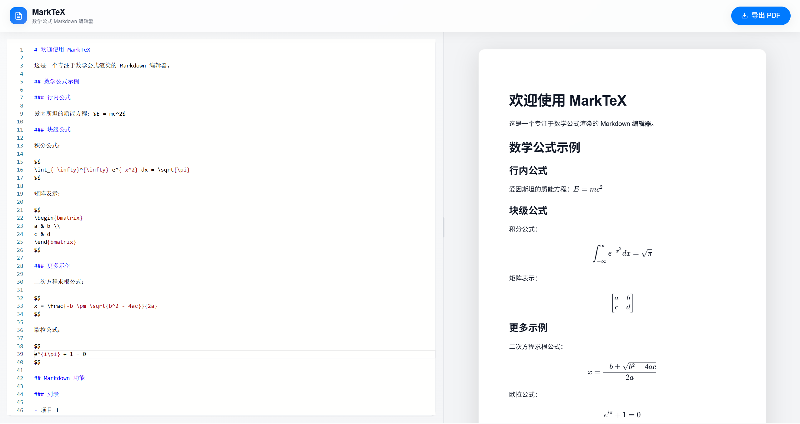

# MarkTeX

<div align="center">


**让数学公式的编辑与导出，像呼吸一样自然**

一个专为学术写作打造的在线 Markdown 编辑器，完美融合 KaTeX 公式渲染与 PDF 导出,支持在线访问http://marktex.koen.top/

[在线体验](http://marktex.koen.top/) | [快速开始](#-快速开始) | [特性](#-核心特性) | [贡献指南](#-参与贡献)

</div>

---

## 🎯 项目动机

在日常的学术写作和技术文档编写中，我们经常面临这样的困境：

- **Overleaf/LaTeX** 过于重量级，学习曲线陡峭，实时预览卡顿
- **Typora/Notion** 对复杂数学公式的渲染支持不够完善
- **在线 Markdown 编辑器** 导出的 PDF 格式混乱，公式显示错位或乱码
- **Google Docs** 编辑数学公式的体验极其糟糕

> **MarkTeX 的诞生就是为了解决这个痛点：**  
> 让你用最熟悉的 Markdown 语法，配合强大的 KaTeX 引擎，在浏览器中实时预览复杂公式，并一键导出高保真 PDF —— 所见即所得，零妥协。

---

## ✨ 核心特性

### 📐 完美的数学公式支持
- ⚡ **毫秒级实时渲染** - 基于 KaTeX 引擎，输入即显示
- 🎓 **完整的 LaTeX 语法** - 支持矩阵、积分、求和、分式等所有常用数学符号
- 🔍 **180+ LaTeX 命令补全** - 输入 `\` 自动提示，支持 snippet 占位符跳转
- 💡 **中文友好提示** - 每个命令都有清晰的中文说明

### 📝 极致的编辑体验
- 🖥️ **VSCode 级编辑器** - 集成 Monaco Editor，代码高亮、智能补全、平滑滚动
- 🔄 **实时双向预览** - 左侧编辑，右侧即时渲染，像魔法一样流畅
- 📏 **可拖拽分割** - 自由调整编辑器与预览区的比例
- 🎨 **Apple 设计语言** - 毛玻璃效果、优雅动画、无滚动条干扰

### 📄 高质量 PDF 导出
- 🎯 **一键导出** - 点击按钮即可生成专业级 PDF
- 🖼️ **完美还原** - 公式清晰、排版精准、样式一致
- 📐 **A4 标准** - 符合国际标准的页面尺寸和边距
- 🎨 **颜色保真** - 确保所有元素在 PDF 中完整呈现

### 🌈 其他亮点
- 📊 **GitHub Flavored Markdown** - 支持表格、任务列表等扩展语法
- 🚫 **完全隐藏滚动条** - 极简界面，专注内容创作
- ⚙️ **零配置启动** - 开箱即用，无需复杂设置
- 📱 **响应式设计** - 适配各种屏幕尺寸

---

## 🚀 快速开始

### 环境要求
- Node.js >= 18.0
- npm >= 9.0

### 安装与运行

```bash
# 1. 克隆项目
git clone https://github.com/yourusername/marktex.git
cd marktex

# 2. 安装依赖
npm install

# 3. 启动开发服务器
npm run dev

# 4. 浏览器打开 http://localhost:3000
```

### 构建生产版本

```bash
# 构建优化后的静态文件
npm run build

# 预览构建结果
npm run preview
```

---

## 📖 使用指南

### 基础 Markdown

```markdown
# 一级标题
## 二级标题

**粗体** *斜体* `代码`

- 列表项 1
- 列表项 2

> 引用文本
```

### 数学公式

**行内公式**（使用单个 `$`）：
```markdown
爱因斯坦质能方程：$E = mc^2$
```

**块级公式**（使用双 `$$`）：
```markdown
$$
\int_{-\infty}^{\infty} e^{-x^2} dx = \sqrt{\pi}
$$
```

### LaTeX 命令补全

1. 输入 `\` 触发自动补全
2. 使用方向键选择命令
3. 按 `Enter` 或 `Tab` 插入
4. 对于 `\frac`、`\sum` 等命令，按 `Tab` 在占位符间跳转

**提示：** 支持 180+ 常用 LaTeX 命令，包括希腊字母、数学符号、矩阵、三角函数等。

### PDF 导出技巧

1. 点击顶部 "导出 PDF" 按钮
2. 在打印对话框中：
   - 点击 "更多设置"
   - **取消勾选 "页眉和页脚"**
   - 选择 "保存为 PDF"
3. 完成！获得高质量的数学文档

---

## 🛠️ 技术栈

| 技术 | 用途 |
|------|------|
| **React 18** | 现代化 UI 框架 |
| **TypeScript** | 类型安全开发 |
| **Vite** | 极速构建工具 |
| **Tailwind CSS** | 原子化 CSS 框架 |
| **Monaco Editor** | VSCode 同款编辑器内核 |
| **react-markdown** | Markdown 渲染引擎 |
| **KaTeX** | 数学公式渲染引擎 |
| **remark-math & rehype-katex** | Markdown 数学扩展 |
| **remark-gfm** | GitHub Flavored Markdown 支持 |
| **react-to-print** | PDF 导出功能 |
| **lucide-react** | 优雅图标库 |

---

## 🗺️ 开发路线图

### ✅ 已完成

由于本人是一个苦逼大学生，时间有限，希望大家能参与进这个项目

- [x] 实时 Markdown 预览
- [x] KaTeX 数学公式渲染
- [x] LaTeX 命令智能补全（180+ 命令）
- [x] 高质量 PDF 导出
- [x] 可拖拽分割布局
- [x] GitHub Flavored Markdown 支持

### 🚧 进行中
- [ ] **暗色模式** - 支持深色主题切换
- [ ] **本地存储** - 自动保存编辑内容到浏览器
- [ ] **快捷键系统** - 提供 Markdown 编辑快捷键
- [ ] **🤖 AI 写作助手** - 集成大语言模型（LLM），智能生成和润色文档内容
- [ ] **👥 实时协作** - 支持多人同时编辑（类似 Google Docs）
- [ ] **💾 本地文件系统访问** - 直接打开和保存本地 `.md` 文件（使用 File System Access API）
- [ ] **📦 文件导入导出** - 支持导入本地 Markdown 文件和导出为 `.md` 格式
- [ ] **🌐 云端同步** - 集成云存储服务（Dropbox/Google Drive）
- [ ] **📚 模板库** - 提供论文、报告、笔记等常用模板
- [ ] **🔍 全文搜索** - 快速查找和替换功能
- [ ] **📊 字数统计** - 详细的字数、字符数、阅读时间统计
- [ ] **🎨 自定义主题** - 允许用户自定义配色方案

---

## 📸 项目截图

<div align="center">

### 编辑界面


</div>

---

## 🤝 参与贡献

我们热烈欢迎各种形式的贡献！无论是：

- 🐛 报告 Bug
- 💡 提出新功能建议
- 📝 改进文档
- 🔧 提交代码

### 贡献步骤

1. Fork 本仓库
2. 创建你的特性分支 (`git checkout -b feature/AmazingFeature`)
3. 提交你的修改 (`git commit -m 'Add some AmazingFeature'`)
4. 推送到分支 (`git push origin feature/AmazingFeature`)
5. 开启一个 Pull Request

### 开发指南

```bash
# 安装依赖
npm install

# 启动开发服务器（支持热更新）
npm run dev

# 代码检查
npm run lint

# 类型检查
npm run type-check

# 构建生产版本
npm run build
```

---

## 📄 许可证

本项目采用 [MIT License](LICENSE) 开源协议。

---

## 🙏 致谢

特别感谢以下开源项目：

- [React](https://react.dev/) - UI 框架
- [KaTeX](https://katex.org/) - 数学公式渲染引擎
- [Monaco Editor](https://microsoft.github.io/monaco-editor/) - 强大的代码编辑器
- [Tailwind CSS](https://tailwindcss.com/) - 实用优先的 CSS 框架

---


<div align="center">

**如果这个项目对你有帮助，请给个 ⭐️ Star 支持一下！**

Made with ❤️ by keHe

</div>
